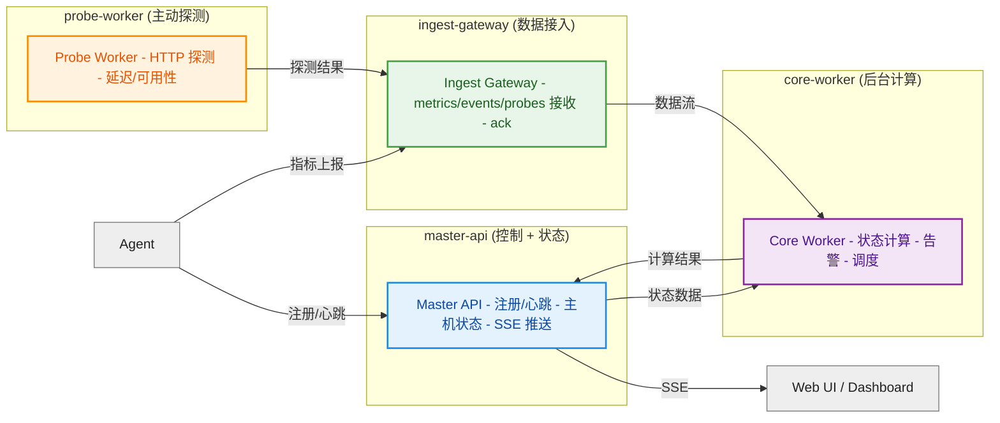

# 高明/ Gaoming


一个端监控系统。

> 高明是明代神魔小说《封神演义》中的虚拟角色，本体为棋盘山桃精，与其弟柳鬼高觉（顺风耳）并称千里眼。

# [在线demo](https://gaoming.gofxq.com/default) 


## 文档索引

- [docs/00-summary.md](/home/u/dev/github.com/gofxq/gaoming/docs/00-summary.md)
- [docs/01-data-model.md](/home/u/dev/github.com/gofxq/gaoming/docs/01-data-model.md)
- [docs/02-contracts.md](/home/u/dev/github.com/gofxq/gaoming/docs/02-contracts.md)
- [docs/03-runtime-flow.md](/home/u/dev/github.com/gofxq/gaoming/docs/03-runtime-flow.md)
- [docs/04-layout.md](/home/u/dev/github.com/gofxq/gaoming/docs/04-layout.md)
- [docs/05-local-run.md](/home/u/dev/github.com/gofxq/gaoming/docs/05-local-run.md)
- [docs/06-repository-hygiene.md](/home/u/dev/github.com/gofxq/gaoming/docs/06-repository-hygiene.md)
- [docs/07-oss-options.md](/home/u/dev/github.com/gofxq/gaoming/docs/07-oss-options.md)
- [docs/08-persistence-runtime.md](/home/u/dev/github.com/gofxq/gaoming/docs/08-persistence-runtime.md)
- [docs/99-status-roadmap.md](/home/u/dev/github.com/gofxq/gaoming/docs/99-status-roadmap.md)

## 系统方案





## 快速开始

本机构建：

```bash
make fmt
make build
make test
```

Docker 启动：

```bash
make docker-up
make smoke
make run-agent
make smoke-agent
make docker-ps
make docker-logs
make docker-down
```

如果你只是为了本地测试，推荐默认用这个模式：

- 后端服务走 Docker
- `agent` 直接运行在宿主机

这样 agent 采到的是宿主机真实数据，而不是容器视角的混合数据。

当前默认上报频率是 `1s`，页面会在同一个时间窗口内同时展示：

- CPU
- 内存
- 可用内存
- Swap
- 磁盘用量
- 磁盘剩余
- inode 用量
- 磁盘读
- 磁盘写
- 磁盘读 IOPS
- 磁盘写 IOPS
- 负载
- 网络 RX
- 网络 TX
- 网络收包
- 网络发包

如果你只是想保留容器里跑 agent 的对比入口：

```bash
make docker-up-full
```

前端状态页：

```text
http://127.0.0.1:8080/
```

实时推送流：

```text
http://127.0.0.1:8080/api/v1/stream/hosts
```

常用校验：

```bash
make check
make compose-config
```

## Agent 发布与安装

仓库增加了 GitHub Actions 工作流 [build-agent.yml](/home/u/dev/github.com/gofxq/gaoming/.github/workflows/build-agent.yml)，会自动编译 Linux、Darwin、Windows 的 agent。

- 推送到 `main` 时会产出 workflow artifact。
- 推送 `v*` tag 时会同时发布 release 资产：
  - `gaoming-agent_linux_amd64.tar.gz`
  - `gaoming-agent_linux_arm64.tar.gz`
  - `gaoming-agent_darwin_amd64.tar.gz`
  - `gaoming-agent_darwin_arm64.tar.gz`
  - `gaoming-agent_windows_amd64.zip`
  - `gaoming-agent_windows_arm64.zip`
  - `checksums.txt`

默认安装参数：

- `master_api_url`: `https://gm-metric.gofxq.com/`
- `ingest_gateway_url`: `https://gm-metric.gofxq.com/`
- `loop_interval_sec`: `5`
- `tenant_code`: 如果不指定则传空，由服务端生成

Linux / macOS 一键安装：

```bash
curl -fsSL https://raw.githubusercontent.com/gofxq/gaoming/main/deployments/install-agent.sh | \
sudo sh -s -- \
  --master-url https://gm-metric.gofxq.com/ \
  --ingest-url https://gm-metric.gofxq.com/ \
  --loop-interval-sec 5
```

Linux 上会安装成 `systemd` 服务，macOS 上会安装成 `launchd` 服务。安装脚本是 [install-agent.sh](/home/u/dev/github.com/gofxq/gaoming/deployments/install-agent.sh)。

Windows 一键安装：

```powershell
powershell -ExecutionPolicy Bypass -Command "iwr https://raw.githubusercontent.com/gofxq/gaoming/main/deployments/install-agent.ps1 -UseBasicParsing | iex"
```

Windows 会注册为开机启动计划任务，脚本在 [install-agent.ps1](/home/u/dev/github.com/gofxq/gaoming/deployments/install-agent.ps1)。

卸载：

Linux / macOS：

```bash
curl -fsSL https://raw.githubusercontent.com/gofxq/gaoming/main/deployments/uninstall-agent.sh | \
sudo sh
```

Windows：

```powershell
powershell -ExecutionPolicy Bypass -Command "iwr https://raw.githubusercontent.com/gofxq/gaoming/main/deployments/uninstall-agent.ps1 -UseBasicParsing | iex"
```

远程安装脚本默认会：

- 从 GitHub Releases 下载最新 agent 包
- Linux 安装到 `/opt/gaoming-agent`
- macOS 安装到 `/usr/local/gaoming-agent`
- Windows 安装到 `%ProgramFiles%\GaomingAgent`
- 写入安装目录下的 `agent-config.yaml`
- 注册对应平台的开机自启动服务

如果需要指定版本：

```bash
curl -fsSL https://raw.githubusercontent.com/gofxq/gaoming/main/deployments/install-agent.sh | \
sudo VERSION=v0.1.0 sh -s -- \
  --tenant tenant-custom \
  --master-url https://gm-metric.gofxq.com/ \
  --ingest-url https://gm-metric.gofxq.com/
```

如果你是在 agent 所在机器上直接拉了仓库代码，希望用本地最新代码重新编译并更新 service，可以用 [install-agent-local.sh](/home/u/dev/github.com/gofxq/gaoming/deployments/install-agent-local.sh)：

```bash
go build -o ./gaoming-agent ./agent/daemon/cmd/agent
bash ./deployments/install-agent-local.sh --bin ./gaoming-agent
```

这个脚本会：

- 读取你通过 `--bin` 指定的二进制文件
- 直接读取当前目录的 `agent-config.yaml`
- 覆盖安装 `/opt/gaoming-agent/gaoming-agent`
- 覆盖安装 `/opt/gaoming-agent/agent-config.yaml`
- 需要时自动使用 `sudo` 安装和重启 service
- 执行 `systemctl restart gaoming-agent`

因此后续代码更新后，重新 `go build` 一次，再重复执行同一个安装命令就能完成本地升级。也可以直接用：

```bash
make install-agent-local-service
```

## 当前实现范围

当前版本优先让项目“完整跑起来”，因此先实现：

- `master-api`：Agent 注册、Heartbeat、主机查询、运维接口。
- `ingest-gateway`：指标、事件、探测接入与计数。
- `core-worker`：合并后的后台 worker 占位。
- `probe-worker`：周期性 HTTP 探测并上报结果。
- `agent`：自动注册、上报 heartbeat 和 metric batch。

## TODO

- React 看板的 16 个指标已补齐，但旧的 embed 页 [ui_index.html](/Volumes/afs/dev/github.com/gofxq/gaoming/services/master-api/internal/transport/http/ui_index.html) 还没同步。
- 第二梯队指标暂缓：`net_rx_errors_ps`、`net_tx_errors_ps`、`load5`、`uptime_seconds`。
- 数据库兼容当前仍依赖重建本地库或手工执行 `ALTER TABLE`，还没有正式迁移机制。
- `ingest-gateway` 仍只接收并 ack metric batch，尚未对新增指标做持久化或下游消费。

当前版本里，`master-api` 负责主机当前状态和页面输出，`ingest-gateway` 负责写入接入，`probe-worker` 负责主动探测，`core-worker` 仍是后续状态引擎、告警引擎和调度逻辑的预留位置。

README 原始的大型设计内容已经拆分到 `docs/` 中继续维护。
