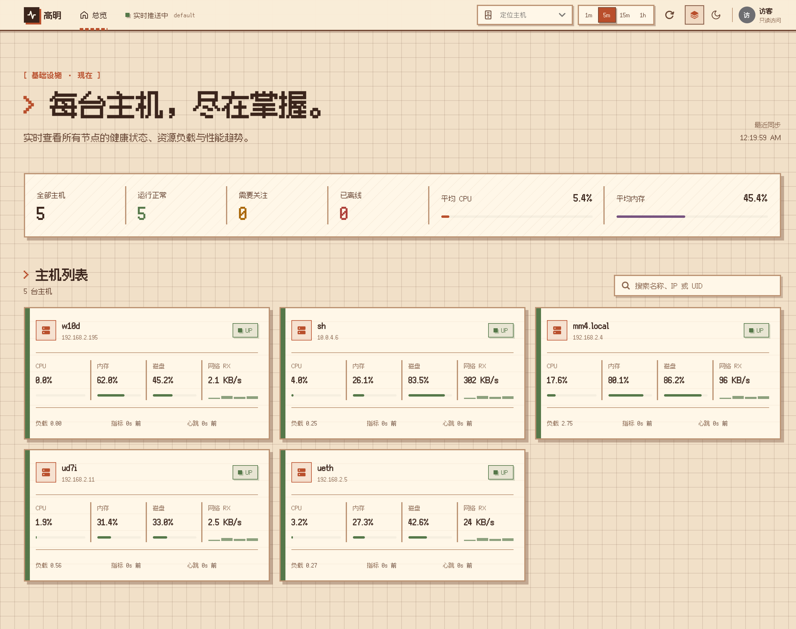
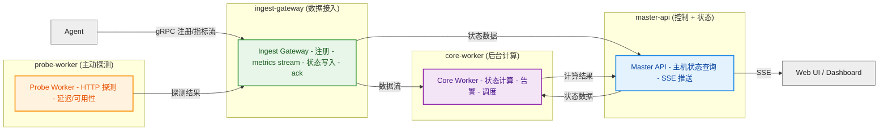

# 高明 / Gaoming


> 高明是明代神魔小说《封神演义》中的虚拟角色，本体为棋盘山桃精，与其弟柳鬼高觉（顺风耳）并称千里眼。

## 🚀 快速体验

```bash
curl -fsSL https://raw.githubusercontent.com/gofxq/gaoming/master/deployments/install-agent.sh | sudo sh
```

安装完成后展示：
```bash
web-url [https://gm-metric.gofxq.com/]:
ingest-grpc-addr [gm-rpc.gofxq.com:443]:
tenant [<auto>]:
loop-interval-sec [5]: 1
[+] downloading gaoming-agent_linux_amd64.tar.gz
[+] installed gaoming-agent to /opt/gaoming-agent
[+] config: /opt/gaoming-agent/agent-config.yaml
[+] tenant_code: default
[+] dashboard: https://gm-metric.gofxq.com/default
```


安装完成后打开dashboard即可。手机端可打开增加 pwa 支持安装至手机。

[PWA](https://gm-metric.gofxq.com/default/pwa)


一个面向主机与节点的轻量监控系统：Agent 自动注册、持续上报指标，Web 端按租户展示实时状态。


🔗 在线 Demo: [https://gaoming.gofxq.com/default](https://gaoming.gofxq.com/default)
## WEB


## PWA
| 横屏                                      | 竖屏｜                                     |                                          |
| ----------------------------------------- | ------------------------------------------ | ---------------------------------------- | ----------------------------------------- |
|  |  |  |  |

## ✨ 核心能力

- Agent 自动注册、流式指标上报
- Dashboard 实时展示主机状态与窗口指标
- 租户隔离：页面走 `/<tenantCode>`，接口走 `?tenant=...`
- 支持 Linux / macOS / Windows 安装脚本
- 支持 Docker 启动后端，本机直跑 Agent 调试
  

## 💻 系统方案





## ⚡️ 快速开始

推荐本地开发模式：

- 后端服务走 Docker
- Agent 直接运行在宿主机，采集真实宿主机数据

启动：

```bash
make docker-up
make run-agent
```

如果要从宿主机验证标准 gRPC 上报：

```bash
MASTER_API_URL=http://127.0.0.1:8080 \
INGEST_GATEWAY_GRPC_ADDR=127.0.0.1:8091 \
AGENT_CONFIG_PATH=/tmp/gaoming-agent-grpc.yaml \
make run-agent
```

打开：

```text
http://127.0.0.1:8080/default
```

常用命令：

```bash
make smoke
make smoke-agent
make docker-logs
make docker-down
make check
```

宿主机 gRPC 模式可这样验：

```bash
TENANT=<agent-config.yaml 里的 tenant_code> \
MASTER_URL=http://127.0.0.1:8080 \
INGEST_URL=http://127.0.0.1:8090 \
make smoke-agent
```

如果你想连 Agent 也跑在容器里：

```bash
make docker-up-full
```

## 📦 安装 Agent

mac/ linux 一行安装命令：

```bash
curl -fsSL https://raw.githubusercontent.com/gofxq/gaoming/master/deployments/install-agent.sh | sudo sh
```

安装脚本会交互式提示以下参数，直接回车就用默认值：

- `web-url`: `https://gm-metric.gofxq.com/`
- `ingest-grpc-addr`: `gm-rpc.gofxq.com:443`
- `tenant`: 留空则由 Agent 启动后向 `master-api` 获取，失败则本地生成
- `loop-interval-sec`: `5`

安装完成后，脚本会输出：

- `tenant_code`
- 带 tenant 的 Dashboard 地址
- 带 tenant 参数的 Hosts API 地址

平台行为：

- Linux 注册为 `systemd` 服务
- macOS 注册为 `launchd` 服务
- Windows 使用 PowerShell 安装脚本

Windows 安装：

```powershell
powershell -ExecutionPolicy Bypass -Command "iwr https://raw.githubusercontent.com/gofxq/gaoming/main/deployments/install-agent.ps1 -UseBasicParsing | iex"
```

卸载：

```bash
curl -fsSL https://raw.githubusercontent.com/gofxq/gaoming/main/deployments/uninstall-agent.sh | sudo sh
```

如果需要指定版本：

```bash
curl -fsSL https://raw.githubusercontent.com/gofxq/gaoming/main/deployments/install-agent.sh | sudo VERSION=v0.1.0 sh
```

如果你已经在目标机器拉了仓库代码，想用本地最新代码覆盖安装服务：

```bash
make install-agent-local-service
```

相关脚本：

- [deployments/install-agent.sh](deployments/install-agent.sh)
- [deployments/install-agent-local.sh](deployments/install-agent-local.sh)
- [deployments/install-agent.ps1](deployments/install-agent.ps1)

## 🧩 服务组成

- `master-api`: 主机状态查询、SSE 推送
- `ingest-gateway`: Agent 注册、指标流、事件、探测数据接入
- `core-worker`: 后台计算与聚合
- `probe-worker`: 主动探测
- `agent`: 主机侧采集与上报

## 📚 文档

- [docs/00-summary.md](docs/00-summary.md)
- [docs/01-data-model.md](docs/01-data-model.md)
- [docs/02-contracts.md](docs/02-contracts.md)
- [docs/03-runtime-flow.md](docs/03-runtime-flow.md)
- [docs/04-layout.md](docs/04-layout.md)
- [docs/05-local-run.md](docs/05-local-run.md)
- [docs/06-repository-hygiene.md](docs/06-repository-hygiene.md)
- [docs/07-oss-options.md](docs/07-oss-options.md)
- [docs/08-persistence-runtime.md](docs/08-persistence-runtime.md)
- [docs/plans/99-roadmap.md](docs/plans/99-roadmap.md)
