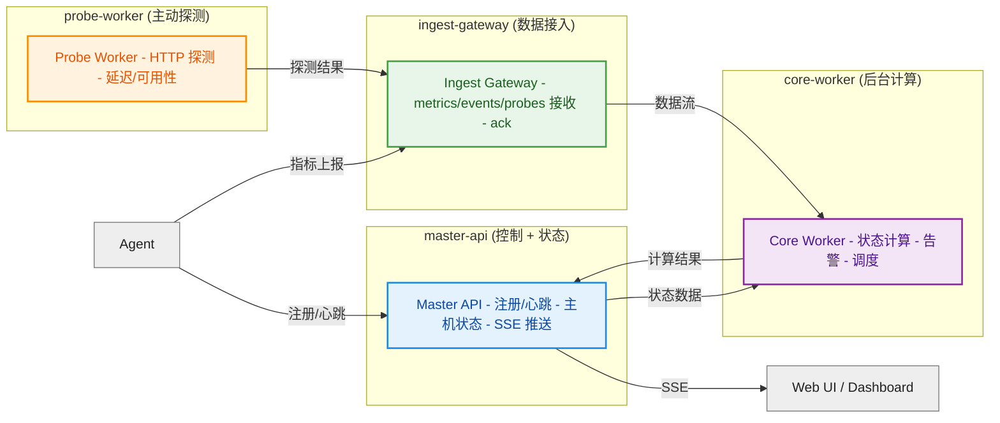

# Gaoming


一个监控系统。




## 文档索引

- [docs/00-summary.md](/home/u/dev/github.com/gofxq/gaoming/docs/00-summary.md)
- [docs/01-data-model.md](/home/u/dev/github.com/gofxq/gaoming/docs/01-data-model.md)
- [docs/02-contracts.md](/home/u/dev/github.com/gofxq/gaoming/docs/02-contracts.md)
- [docs/03-runtime-flow.md](/home/u/dev/github.com/gofxq/gaoming/docs/03-runtime-flow.md)
- [docs/04-layout.md](/home/u/dev/github.com/gofxq/gaoming/docs/04-layout.md)
- [docs/05-local-run.md](/home/u/dev/github.com/gofxq/gaoming/docs/05-local-run.md)
- [docs/06-repository-hygiene.md](/home/u/dev/github.com/gofxq/gaoming/docs/06-repository-hygiene.md)
- [docs/07-oss-options.md](/home/u/dev/github.com/gofxq/gaoming/docs/07-oss-options.md)
- [docs/08-persistence-runtime.md](/home/u/dev/github.com/gofxq/gaoming/docs/08-persistence-runtime.md)
- [docs/99-status-roadmap.md](/home/u/dev/github.com/gofxq/gaoming/docs/99-status-roadmap.md)

## 快速开始

本机构建：

```bash
make fmt
make build
make test
```

Docker 启动：

```bash
make docker-up
make smoke
make run-agent
make smoke-agent
make docker-ps
make docker-logs
make docker-down
```

如果你只是为了本地测试，推荐默认用这个模式：

- 后端服务走 Docker
- `agent` 直接运行在宿主机

这样 agent 采到的是宿主机真实数据，而不是容器视角的混合数据。

当前默认上报频率是 `1s`，页面会在同一个时间窗口内同时展示：

- CPU
- 内存
- 磁盘用量
- 磁盘读
- 磁盘写
- 负载
- 网络 RX
- 网络 TX

如果你只是想保留容器里跑 agent 的对比入口：

```bash
make docker-up-full
```

前端状态页：

```text
http://127.0.0.1:8080/
```

实时推送流：

```text
http://127.0.0.1:8080/api/v1/stream/hosts
```

常用校验：

```bash
make check
make compose-config
```

## 当前实现范围

当前版本优先让项目“完整跑起来”，因此先实现：

- `master-api`：Agent 注册、Heartbeat、主机查询、运维接口。
- `ingest-gateway`：指标、事件、探测接入与计数。
- `core-worker`：合并后的后台 worker 占位。
- `probe-worker`：周期性 HTTP 探测并上报结果。
- `agent`：自动注册、上报 heartbeat 和 metric batch。

当前版本里，`master-api` 负责主机当前状态和页面输出，`ingest-gateway` 负责写入接入，`probe-worker` 负责主动探测，`core-worker` 仍是后续状态引擎、告警引擎和调度逻辑的预留位置。

README 原始的大型设计内容已经拆分到 `docs/` 中继续维护。
