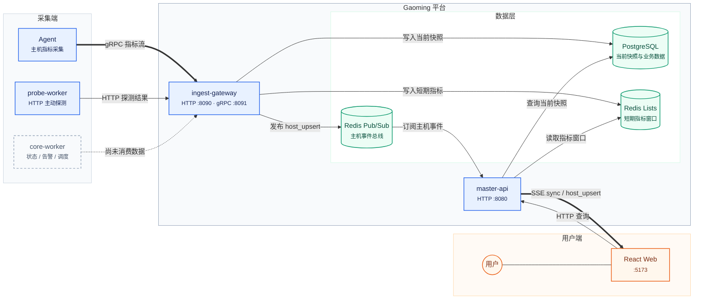
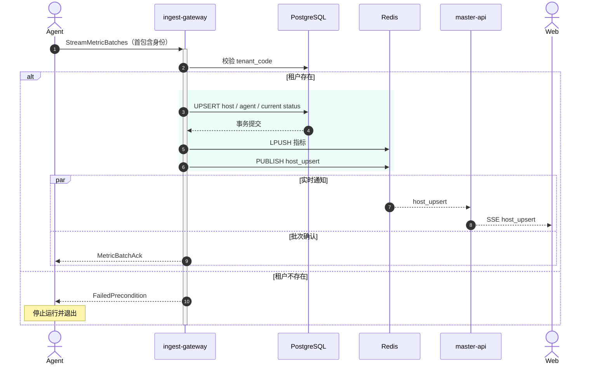
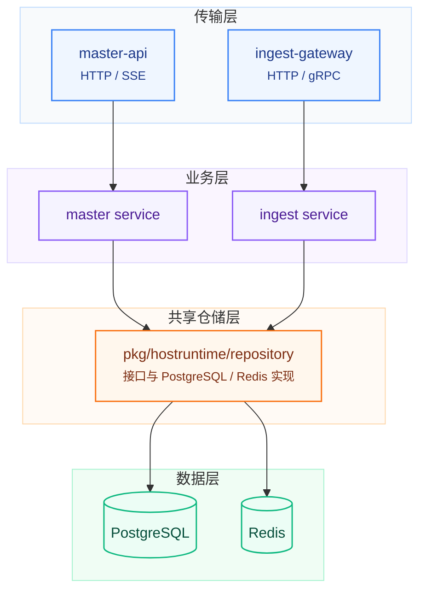

# 系统架构

本文描述 Gaoming 当前代码的实际运行方式。接口和 SQL 中尚未接入运行时的设计会明确标为“未闭环”。

## 系统总图



当前可靠闭环是：

```text
Agent metric batch
  -> ingest-gateway
  -> PostgreSQL + Redis
  -> master-api SSE
  -> Web Dashboard
```

`probe-worker` 可以发起探测并上报，但结果没有继续落库；`core-worker` 尚未参与数据处理。

## 运行单元

| 单元 | 默认端口/入口 | 职责 | 状态 |
| --- | --- | --- | --- |
| Web | `:5173` | 租户路由、主机展示、SSE 实时更新、用户管理 | 已实现 |
| Agent | 主动连接 gRPC | 主机身份发现、系统采样、指标流上报 | 已实现 |
| master-api | HTTP `:8080` | 查询、SSE、会话解析、用户与运维接口 | 已实现 |
| ingest-gateway | HTTP `:8090`、gRPC `:8091` | Agent 接入、快照写入、指标窗口、离线判定 | 已实现 |
| probe-worker | 主动发起 HTTP | 固定目标探测与结果上报 | 部分实现 |
| core-worker | 无监听 | 周期输出 pipeline 日志 | 占位 |
| PostgreSQL | Compose 宿主 `:35432` | 租户、主机、当前状态、用户和运维数据 | 已实现 |
| Redis | Compose 宿主 `:36379` | 短期指标列表和主机事件 Pub/Sub | 已实现 |

## 核心运行时序

### 首包建档与指标上报

Agent 不先调用独立注册接口，而是直接建立 `StreamMetricBatches`。首批数据携带主机身份、`tenant_code` 和 Agent 元数据。



每个后续 batch 的处理顺序是：

1. PostgreSQL 事务更新 `agent_instances` 和 `host_status_current`。
2. 将 16 个窗口指标写入 Redis Lists。
3. 向 Redis Pub/Sub 发布 `host_upsert`。
4. 成功后向 Agent 返回对应 `batch_seq` 的 ACK。

PostgreSQL 与 Redis 不在同一事务内。若数据库提交后 Redis 失败，当前快照已经更新，但历史点或 SSE 通知可能缺失。

### Web 首屏与实时更新

Web 同时发起一次 REST 查询并建立 SSE：

```text
GET /master/api/v1/hosts?tenant=<tenantCode>
GET /master/api/v1/stream/hosts?tenant=<tenantCode>
```

SSE 连接建立后，`master-api` 从 PostgreSQL 读取当前主机列表，从 Redis 读取短期历史，发送 `sync`；后续把 Redis Pub/Sub 中同租户的 `host_upsert` 转发给浏览器。连接中断后浏览器会自动重连，新连接用新的 `sync` 收敛状态。

### 离线判定

`ingest-gateway` 每 5 秒扫描一次。主机超过 15 秒没有 Agent 上报时，会被标记为 `OFFLINE` 并发布新的 `host_upsert`。

### Probe 与 Core

`probe-worker` 定时 GET 配置的目标地址，再 POST 到 `/ingest/api/v1/probes`。`ingest-gateway` 当前仅增加进程内计数，不写 `probe_results`，也不更新 `last_probe_at` 或可达性状态。

`core-worker` 当前只按配置周期输出 `status-engine`、`alert-engine` 和 `probe-scheduler` 的占位日志，没有外部 I/O。

## 服务内部边界

`master-api` 和 `ingest-gateway` 共用 `pkg/hostruntime/repository` 定义的仓储接口及 PostgreSQL/Redis 实现：



`services/master-api/internal/repository` 下还保留旧仓储实现，但当前 App 使用的是共享仓储层，不存在运行时双写。

## 数据职责

### PostgreSQL

当前主链路使用：

- `tenants`：租户。
- `hosts`、`host_labels`：主机身份和标签。
- `agent_instances`：Agent 实例、版本、序号和最后活跃时间。
- `host_status_current`：Dashboard 的权威当前快照。
- `users`、`user_identities`、`user_sessions`：用户和已有会话解析。
- `maintenance_windows`、`alert_events`：部分运维操作。

Schema 由 `deployments/sql/init.sql` 在 PostgreSQL 数据卷首次初始化时执行。服务启动不会自动迁移已有数据库。

### Redis

- 指标窗口：`gaoming:metrics:<host_uid>:<metric_key>`，List 中保存时间和值。
- 事件总线：`gaoming:master-api:host-events`，使用 Pub/Sub 传递 `host_upsert`/`host_delete`。

当前 App 每项指标最多保留 60 个点，TTL 为 2 小时。Pub/Sub 不可重放，PostgreSQL 仍是当前状态的权威来源。

## 租户与认证边界

- 主机列表、详情和 SSE 是公开接口，租户来自 `?tenant=`。
- 受保护接口通过 `gaoming_session` Cookie 查找会话。
- 用户管理要求已登录且角色为 `admin`，并限制在会话租户内。
- 仓库当前没有登录、OAuth 回调或创建会话的 HTTP 路由。
- 维护窗和告警 ACK 虽要求会话，但底层操作仍使用服务默认租户，而非会话租户。

## 部署形态

`docker-compose.yml` 默认定义 PostgreSQL、Redis 和四个后端服务；`web` 与 `agent` 通过 profile 启用：

- `make up`：启用 `web` profile。
- `make up-full`：同时启用 `web` 和 `container-agent` profile。
- 宿主机 Agent 使用根目录 `agent-config.yaml`。
- 各后端进程固定读取 `config/<service>.yml`；Compose 挂载 `config/<service>.docker.yml`。

`config/` 被 `.gitignore` 排除，本地或部署环境必须自行准备配置，示例见[本地开发与验证](../02-guides/local-development.md)。

## 已知缺口与演进优先级

1. **数据一致性**：PostgreSQL、Redis Lists 和 Pub/Sub 缺少统一事务或可靠事件机制。
2. **Probe 闭环**：探测结果未落库，未参与 `reachability_state` 和 `overall_state` 计算。
3. **Core 计算**：状态、告警和调度 pipeline 尚未实现。
4. **可靠上报**：Agent 没有磁盘队列，`batch_seq` 不去重，进程重启后重新计数。
5. **认证与租户**：公开查询依赖可猜测的 tenant code；登录流程和部分运维租户边界不完整。
6. **扩展性**：每个 SSE 连接有独立 Redis 订阅，多实例 ingest 会重复执行离线扫描。

## 关键代码入口

| 主题 | 位置 |
| --- | --- |
| Agent 主循环 | `agent/daemon/internal/service/agent.go` |
| Agent 身份 | `agent/daemon/internal/identity/hostinfo.go` |
| Proto | `api/proto/monitor/v1/*.proto` |
| JSON 契约 | `pkg/contracts/api.go` |
| 主机快照与指标 | `pkg/state/state.go` |
| 共享仓储接口 | `pkg/hostruntime/repository/repository.go` |
| ingest 处理 | `services/ingest-gateway/internal/service/service.go` |
| master HTTP/SSE | `services/master-api/internal/transport/http` |
| Web 路由 | `web/src/app/router.tsx` |
| Web 实时数据 | `web/src/shared/features/hosts/useLiveHostsData.ts` |
| 数据库 Schema | `deployments/sql/init.sql` |
